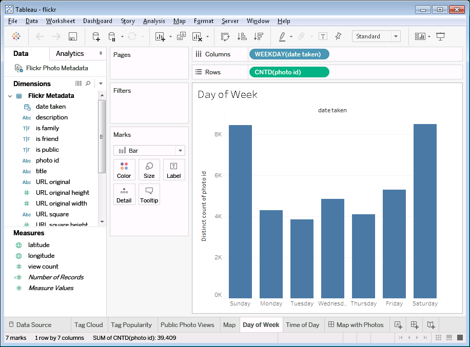
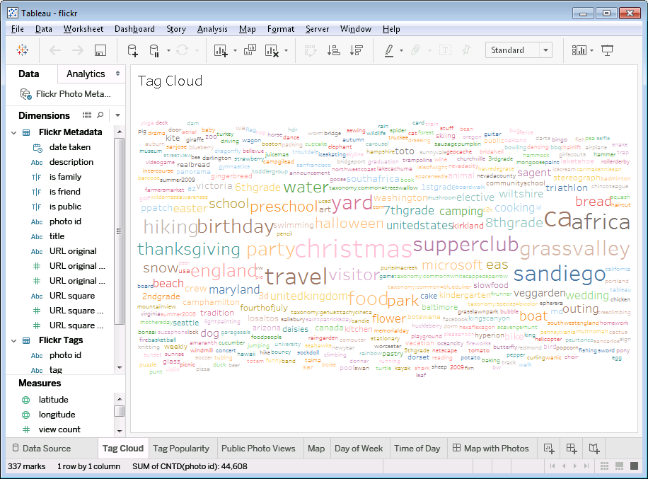
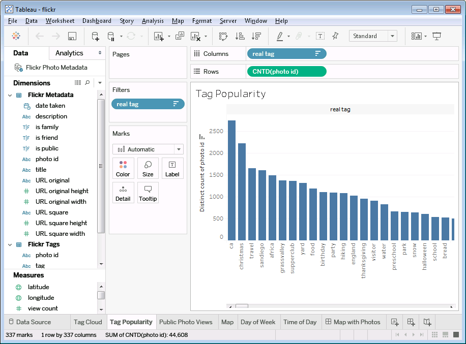
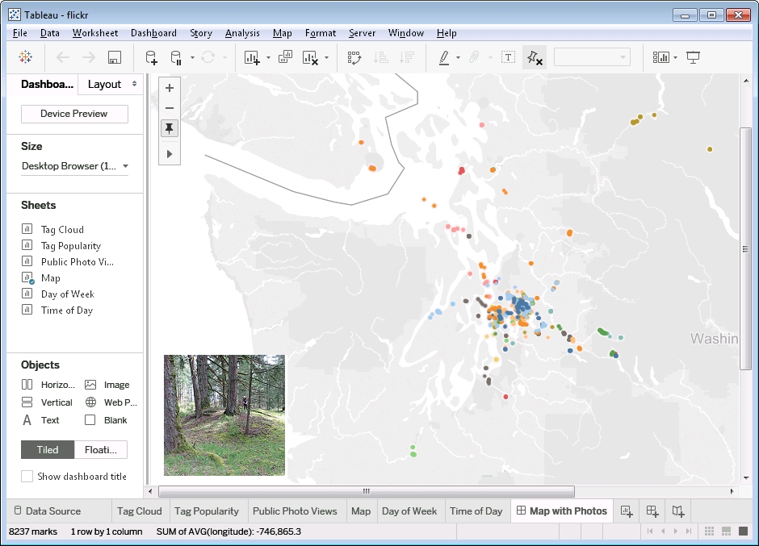

# Tableau Web Data Connector for Flickr

This is a Tableau Web Data Connector for Flickr.
A [Web Data Connector](https://www.tableau.com/web-data-connector) is a component that is used to give [Tableau](https://www.tableau.com) access to data on the web that is exposed via an API.

This Web Data Connector is used to extract photo metadata from your personal photo collection on Flickr.
It requires that you log in with your Flickr credentials.

## What You Can Do With It

You can analyze your photo metadata in a number of ways using Tableau.
Here are a few simple examples:

You can see which day of the week is your most photographed day.

You can create a tag cloud of all your tags.

For more precision, you can create a histogram of tag use frequency.

You can create a map with a dot for each photo and display a photo when you roll over its dot on the map.

## How to Use It

To use the Web Data Connector, create a new Web Data Connector data source in Tableau and enter `https://wdc-flickr-proxy.herokuapp.com/flickr.html`.
You will be directed to Flickr's sign-in page where you will be asked to log in and give the Web Data Connector read-only access to your photos.
Once you have logged in, Tableau will immediately pull in the metadata for your photo collection.
This may take a while depending on the size of your collection.
Tableau doesn't give you any indication of time remaining--you only see a spinner to show that something is happening.

### Data Returned

Two tables are returned.

The first table, `flickrmetadata`, contains one row per photo.
It contains columns for photo metadata like title, description, date taken, etc.
The second table, `flickrtags`, contains one row per tag.
This table has two columns: `photo id` and `tag`.
There may be multiple rows per photo if the photo contains more than one tag.
If a photo has no tags, it won't appear in the table at all.
Both tables contain the `photo id` field, which can be used to join them.

## Source Code Technical Details

This repo contains the source for the Web Data Connector.
It is set up to work as a nodejs app.
I have tested it as localhost on Windows and OSX and via Heroku.
Some environment variables are required if you want to run an instance of the server yourself.

### Required Environment Variables

`FLICKR_WDC_HOSTPATH` the base URL (just the protocol and hostname) of your proxy service.
For example, `https://wdc-flickr-proxy.herokuapp.com`.

`PORT` the port the above server is listening on.
For Heroku, you don't need to set this as it will be defined by the system.
For localhost, you can omit if the port is 80.
That will work for Windows, but not for Mac.

`FLICKR_WDC_API_KEY` the API key you get from Flickr.

`FLICKR_WDC_API_SECRET` the API secret you get from Flickr.

