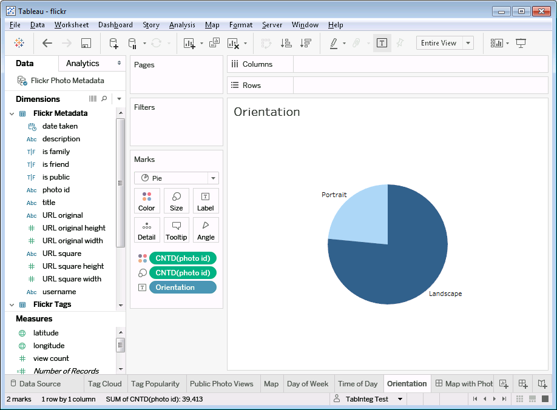
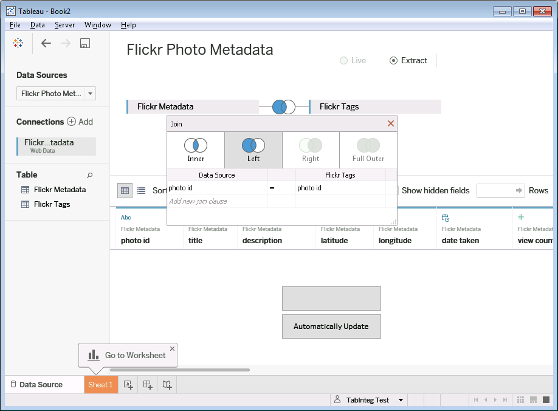

# Tableau Web Data Connector for Flickr

This is a Tableau Web Data Connector for Flickr.
A [Web Data Connector](https://www.tableau.com/web-data-connector) is a component that is used to give [Tableau](https://www.tableau.com) access to data on the web that is exposed via an API.

This Web Data Connector is used to extract photo metadata from your personal photo collection on Flickr.
It requires that you log in with your Flickr credentials.

## What You Can Do With It

You can analyze your photo metadata in a number of ways using Tableau.
Here are a few simple examples:

You can see which day of the week is your most photographed day.

You can create a tag cloud of all your tags.
Clicking a tag opens the browser to Flickr with search results from your collection for that tag.

For more precision, you can create a histogram of tag use frequency.

You can create a map with a dot for each photo and display a photo when you roll over its dot on the map.

You can see how many of your photos are landscape vs. portrait.

## How to Use It

To use the Web Data Connector, create a new Web Data Connector data source in Tableau and enter `https://wdc-flickr-proxy.herokuapp.com/flickr.html`.
You will be directed to Flickr's sign-in page where you will be asked to log in and give the Web Data Connector read-only access to your photos.
Once you have logged in, Tableau will let you drag one or two tables into the Data Source pane.

### Tables

Two tables are returned.

The first table, `flickrmetadata`, contains one row per photo.
It contains columns for photo metadata like title, description, date taken, etc.

The second table, `flickrtags`, contains one row per tag.
This table has two columns: `photo id` and `tag`.
There may be multiple rows per photo if the photo contains more than one tag.
If a photo has no tags, it won't appear in the table at all.

Both tables contain the `photo id` field, which can be used to join them.
If you do a Left join, you will get at least one row per image.
If there are multiple tags assigned to an image, there will be one row per tag for that image.

## Source Code Technical Details

This repo contains the source for the Web Data Connector.
It is set up to work as a nodejs app.
I have tested it as localhost on Windows and OSX and via Heroku.
Some environment variables are required if you want to run an instance of the server yourself.

### Required Environment Variables

`FLICKR_WDC_HOSTPATH` the base URL (just the protocol and hostname) of your proxy service.
For example, `https://wdc-flickr-proxy.herokuapp.com`.

`PORT` the port the above server is listening on.
For Heroku, you don't need to set this as it will be defined by the system.
For localhost, you can omit if the port is 80.
That will work for Windows, but not for Mac.

`FLICKR_WDC_API_KEY` the API key you get from Flickr.

`FLICKR_WDC_API_SECRET` the API secret you get from Flickr.

See [this link](https://www.flickr.com/services/api/misc.api_keys.html) for how to get these keys from Flickr.
Note that these are only required if you want to run your own server.
You can use the Web Data Connector with normal Flickr login credentials.

### Why no Exif Data?

The data returned by the WDC is the most of the basic metadata that Flickr returns in `flickr.people.getphotos`.
This API method returns information for 500 photos at a time in a single HTTP request.
It does not include Exif data.
If you want that, you need to make one additional request per photo.
That is certainly possible to do in the WDC, but it would take quite a big longer to complete the operation there would be 500 times as many HTTP requests required.
If I wanted that level of detail, I would probably write a separate script to extract the data to a text file or database, then use that as the input to Tableau.

### Why a Server is Required?

There are two reasons why a server component is necessary for this WDC: same origin policy and security of the developer API key and secret.

#### Same Origin Policy

The web browser control embedded in Tableau enforces the "Same Origin Policy."
This is a security measure that ensures that AJAX requests can only be made to the domain where the running Javascript came from.
For example, if a Web Data Connector was downloaded from example.com, it cannot make AJAX requests to flickr.com.
Well technically, it can make the request, but the response will be blocked by the browser control.

There are generally two solutions to this problem, and they both require server cooperation.
(And Flickr does not cooperate.)
First, the server could use JSONP.
Flickr supports JSONP for all it's normal API calls, but not for OAuth.
Second, the server could set a header to allow this to work: `Access-Control-Allow-Origin`.
Flickr does not support this either.
It is possible to stand up a single-purpose CORS proxy for this.
It's sole functionality is to add the `Access-Control-Allow-Origin` header to all responses coming from Flickr.

For more information on this topic, see [this Tableau documentation](https://onlinehelp.tableau.com/current/api/wdc/en-us/WDC/wdc_cors.htm).

#### Securing the Flickr Developer API Key and Secret

The Flickr API requires that all authenticated API calls be signed with both the OAuth access token and the Flickr developer API key and API secret.
If this signing were done in the client Javascript, it would be trivial for anyone to capture the API key and secret.
By forwarding the Flickr API calls to the server component of the WDC to do the signing, the API key and secret remain safe as they are never transferred to the client.

### Authentication with Flickr

The most complex part of the WDC is working with Flickr OAuth authentication.
For details on how that works, see [this link](https://www.flickr.com/services/api/auth.oauth.html).

#### Cookies

There is one place where a cookie is required.
In the Oauth flow, an "OAuth token secret" comes with the request token and is needed to complete the exchange of the request token for the access token.
While the request token is passed to the Flickr sign-in URL and come back as part of the redirect back to the WDC, the token secret is not.
The cookie is used to store this for the duration of the Flickr sign-in UI so that it can be used later.
It is used by the client js as a trigger to indicate that it is being called back after the sign-in UI.
It is deleted as soon as it's not needed any more.
